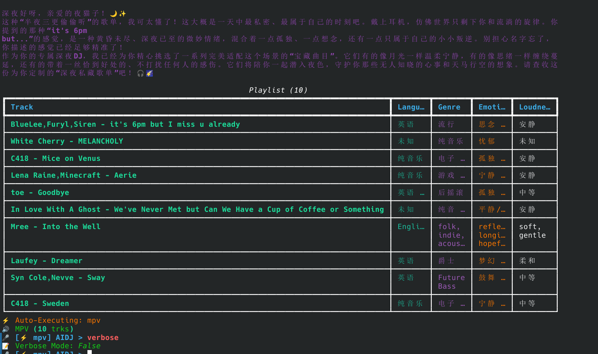
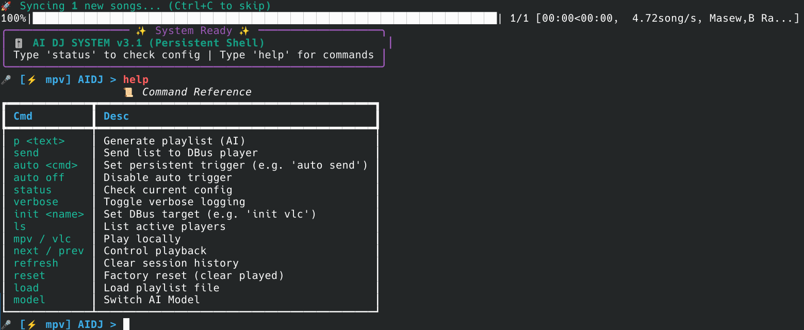
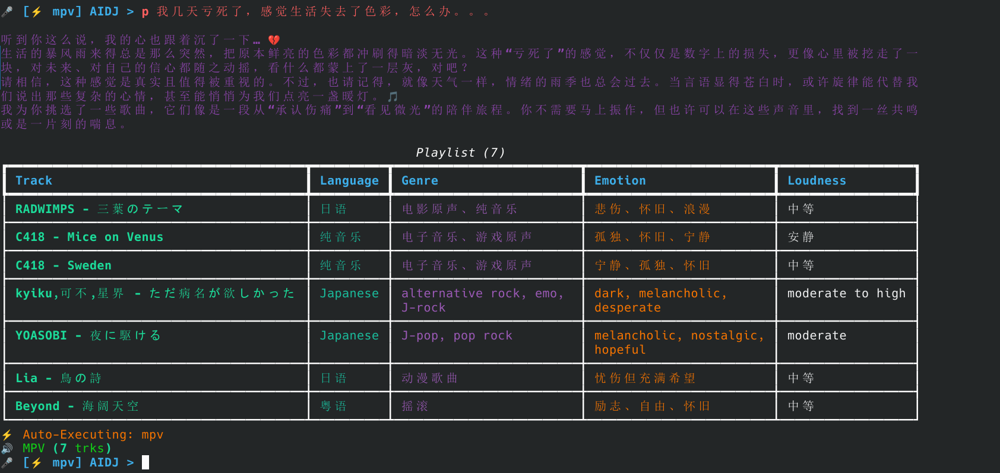
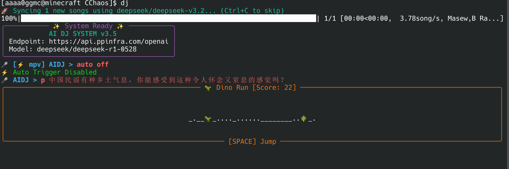
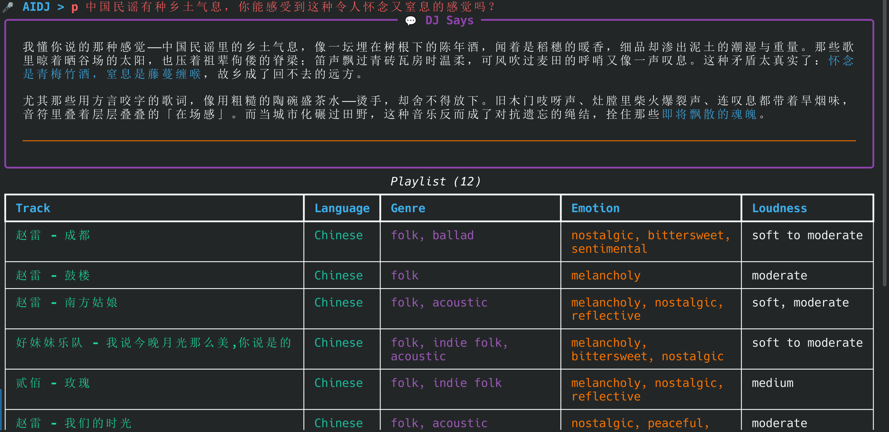

# AIDJ 🎧🙉
你的私人专属DJ，为此时此刻的你提供符合你心意的歌曲。
只需要准备：
- 支持OpenAI API的平台的BaseURL和对应的APIKey
- 一个音乐解析API，我使用的是本地搭建的API，见[这个仓库](https://github.com/Binaryify/NeteaseCloudMusicApi/tree/185031ddcefad34e294df6933418e44cc70ec31f?tab=readme-ov-file) 🔗（PS:下载zip然后偷偷用就行了，不要告诉别人哦🤫🙊）

# 目录
- [支持的功能](#支持的功能)
- [支持的平台](#支持的平台)
- [运行截图](#运行截图)
- [构建](#构建)
- [没本地曲库咋办](#没本地曲库咋办)

# 支持的功能
| 功能 | 详情 |
| :--: | :--: |
| 自然语言交互 | 说出你想听的歌曲类型，你的心情，甚至是一些意义不明的情绪化句子，本软件便能为你生成一个不错的歌单，源自于你的本地音乐库。歌曲质量你本身已经审核了😱😲😯😮🤯 |
| 随心搭配AI | 不局限于DeepSeekAI，只要支持OpenAI的API格式，稍加配置你就可以尽情畅聊🥰 |
| 私有曲库 | 我不提供歌曲下载方式而是使用你的本地歌曲，这不仅可以帮我避免版权问题也可以让你在你精心下载的音乐中畅游🌊🌊 |
| 歌曲元数据增量生成 | 基于你本地的曲库利用AI结合音乐解析API获取的歌曲信息，热评信息自动生成歌曲的元数据并且会在曲库增加的时候自动生成 🤖 |
| RichUI | 利用AI结合rich库vibe除了十分美丽的UI界面，同时DJ输出的信息也进行了Markdown解析，十分好看😍 |
| 多重播放器支持 | 支持启动mpv或者vlc来播放生成的歌单。什么？你不使用这两个，你使用smplayer?😱😱😱😱我们还支持DBUS控制，因此在Linux平台，只要你的软件实现了dbus，就能运行。什么？你是windows并且不使用vlc和mpv？那我没辙了，自己clone vibe去吧 |
| 等待的时候还能玩游戏 | 当你的metadata数据量太大时，AI的推荐耗时可能会高达40多秒，这是不可忍受的，因此我vibe出来了等待时的小游戏界面，支持随机观看老虎机，玩pingpong，玩贪吃蛇，玩永远都跳不过第一个obstacle的恐龙游戏 🎲🎮 |
| 超多命令支持 | 类bash的听歌体验，下文有一个section将讲述所有命令 |

# 支持的平台
- Linux
- MacOS(Maybe)
如果你希望在Windows系统也有这个体验，可以自己拿main.py和wait_game.py拿给AI vibe出来。

# 运行截图
歌单推荐

启动时截图

和AIDJ对话

## 新版本截图
等待中

完成


# 构建
## 前置要求
你需要有python，建议使用uv进行局部管理，接着建议拥有mpv/vlc中的一个。
在ArchLinux中安装步骤如下：
```bash
sudo pacman -S uv mpv vlc mpv-mpris # mpv-mpris是为了让mpv支持dbus控制
```

## 克隆仓库
```bash
git clone https://github.com/aaaa0ggMC/AIDJ.git
cd AIDJ
```

## 创建虚拟环境，安装依赖
```bash
uv venv -p 3.10 # 选择python3.10
uv pip install -r requirements.txt # 安装依赖
```

## 创建配置文件
在main.py目录下创建config.json，其中preferences不是必选项目，可以不写，程序后自动生成，其他为必选项目。
```json
{
    "music_folders": [
        "本地音乐库地址"
    ],
    "secrets": {
        "deepseek": "你的API密钥"
    },
    "ai_settings": {
        "base_url": "你选择的endpoint",
        "available_models": [
            "deepseek/deepseek-v3.2",
            "deepseek/deepseek-r1-turbo",
            "deepseek/deepseek-r1-0528",
            "moonshotai/kimi-k2-thinking",
            "minimax/minimax-m2",
            "zai-org/glm-4.7",
            "一堆模型，可以通过/model打开tui然后切换chat_model"
        ],
        "metadata_model": "deepseek/deepseek-v3.2",
        "chat_model": "deepseek/deepseek-r1-turbo"
    },
    "preferences": {
        "model": "deepseek-reasoner",
        "verbose": false,
        "auto_play": false,
        "saved_trigger": "mpv",
        "dbus_target": "vlc"
    }
}
```

## 运行程序
```bash
uv run main.py
```

# 支持的命令
| 命令 | 参数 | 详情 |
| :--: | :--: | :--: |
| exit quit q | - | 退出程序 |
| status check conf | - | 获取当前的配置情况 |
| help ? | - | 获取帮助信息，命令不是很全，但是反正在这里你知道所有command就行 |
| verbose | - | 切换详细输出 |
| p prompt gen | 给AI的提示词，完整的一行 | 发送提示词给AI同时返回AI的说辞以及歌单 |
| refresh | - | 刷新禁播歌单（为了防止重复推荐，每次AI生成的歌单都会加入禁播列表）|
| reset | - | 刷新聊天历史记录，包括禁播歌单。执行完后AI不会拥有之前的记忆 |
| auto | 行为（可选 mpv vlc send off） | 执行完p后执行的行为，比如auto mpv可以在生成歌单后自动打开mpv进行播放而不需要你手动mpv |
| mpv | - | 以当前的playlist启动mpv |
| vlc | - | 以当前的playlist启动vlc |
| ls list | - | 查看当前可用的dbus应用 |
| init | dbus名字 | 初始化绑定的dbus对象，比如 init mpv绑定的就是org.mpris.MediaPlayer2.mpv |
| send | - | 发送当前playlist给绑定好的dbus应用 |
| next n | - | 发送dbus消息，下一首歌 |
| prev | - | 发送dbus消息，上一首歌 | 
| stop | - | 发送dbus消息，停止播放 |
| play | - | 发送dbus消息，开始播放 |
| toggle | - | 发送dbus消息，切换播放状态 |
| model | - | 输入后会进入模型选择界面，可选模型位于config.json中的available models中|
| save | 文件名字 |  把当前的playlist保存到"./playlists/文件名字"中 |
| load | (可选)文件名字 | 从./playlists中加载对应的文件作为playlist，若是为空则打开选择界面 |


# 没本地曲库咋办
方法总比困难多，因此你能找到方法的！！！

# 关于这个项目
90%是AI写的，我因为甚至连python的语法都没学完，因此写了个框架main.old.py就全部拿给AI vibe出来了。

