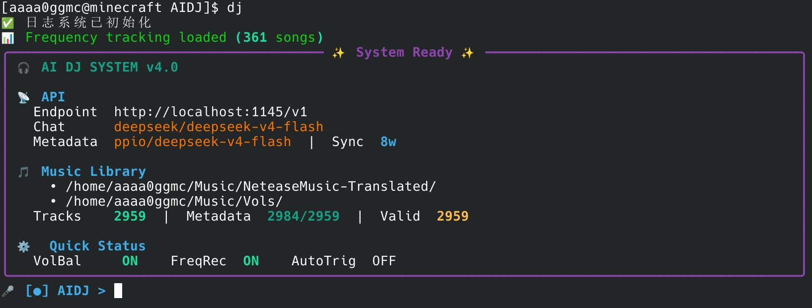
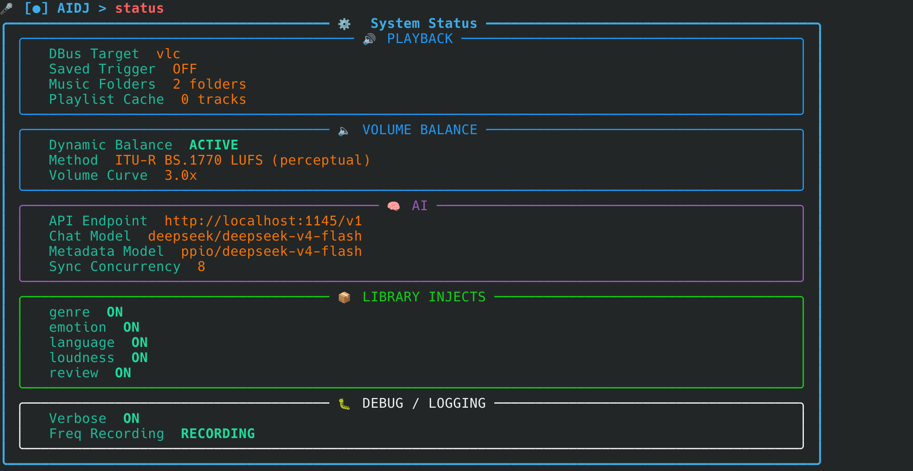
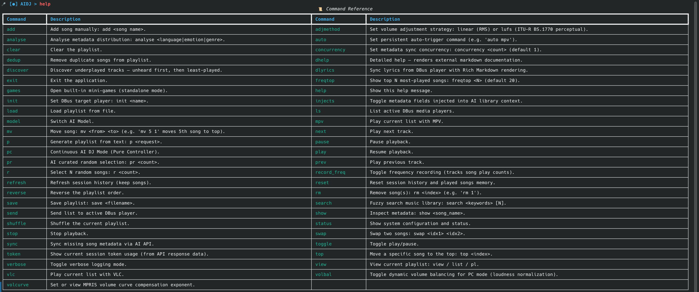
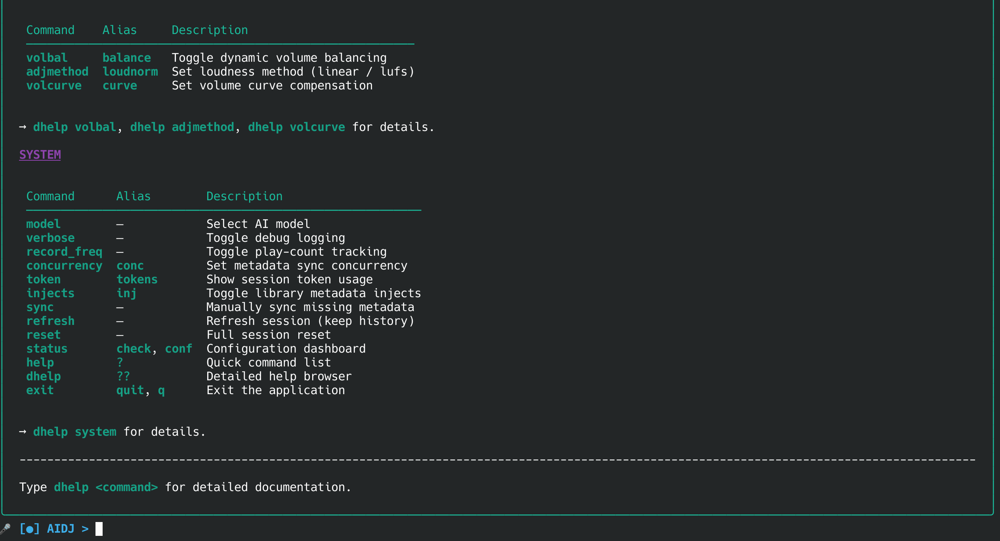
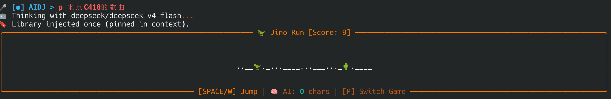
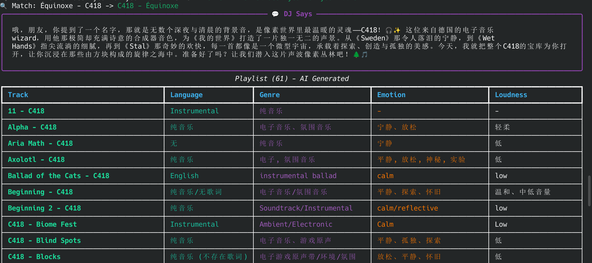
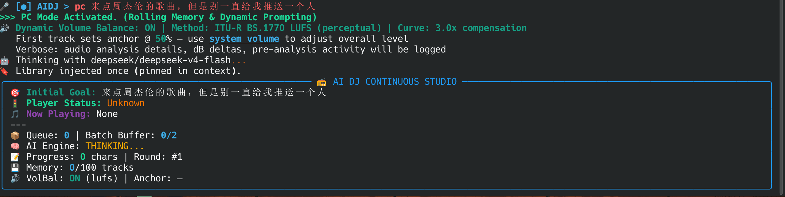
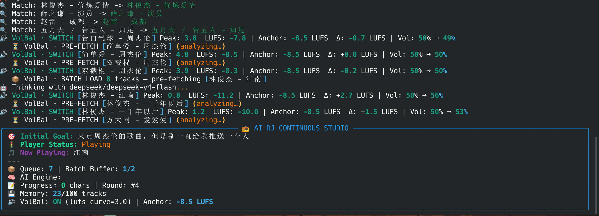

# AIDJ

一个私人的歌曲推送软件，说出你的想法，AI便会在本地曲库中找出一系列符合要求的曲目并串成一个有故事感的歌单。

## 前置准备

这是运行这个项目除了克隆项目以外你必须有的几样东西：

- 支持 OpenAI API的平台的 BaseURL 以及对应的 APIKey
- 一个（实际上就只可以是这个）音乐解析API程序，我是本地搭建的。见[这个仓库](https://github.com/Binaryify/NeteaseCloudMusicApi/tree/185031ddcefad34e294df6933418e44cc70ec31f?tab=readme-ov-file) （PS:下载zip然后偷偷用就行了🤫🙊）
- 本地曲库，不然AI无法进行推荐

## 支持的平台
| 平台   | 支持程度   |
| :--:   | :------:   |
| Linux  |    完整    |
| MacOS  | 大概率可以 |
| Windows| 需要修改部分代码适配 |

## 支持的功能
1. 自然语言交互
说出你想听的歌曲类型、你的心情，甚至是一些意义不明的情绪化句子，AI便能为你从本地曲库生成一个不错的歌单。歌曲质量你本身已经审核了。

2. 随心搭配AI
不局限于DeepSeek，只要支持OpenAI的API格式，稍加配置你就可以尽情畅聊。支持热切换模型，甚至metadata生成和DJ对话可以各用各的模型。

3. 私有曲库
我不提供歌曲下载方式而是使用你的本地歌曲，这不仅可以帮我避免版权问题也可以让你在你精心下载的音乐中畅游。

4. 歌曲元数据增量生成
AI结合音乐解析API获取的歌曲信息和热评，自动生成元数据（语言/情绪/流派/响度/评论），曲库增加时自动补充。

5. Rich TUI
利用AI结合rich库vibe出了十分美丽的UI界面，DJ输出的Markdown渲染、彩色歌单表格、系统状态面板，十分好看。

6. 多重播放器支持
支持启动mpv或者vlc来播放生成的歌单。什么？你不使用这两个，你使用smplayer？😱😱😱😱 我们还支持D-Bus控制，因此在Linux平台，只要你的软件实现了D-Bus，就能运行。什么？你是Windows并且不使用vlc和mpv？那我没辙了，自己clone vibe去吧。

7. 等待的时候还能玩游戏
p模式下AI推荐耗时可能高达几十秒，这是不可忍受的，因此你可以在等待的时候玩会儿小游戏。

8. 歌词显示
同步滚动LRC歌词，支持沉浸模式。

9. 动态音量平衡
ITU-R BS.1770 LUFS感知响度归一化，歌单内音量自动均衡，再也不用手动调音量了。

10. 曲库分析
`/analyse`命令分析曲库的语言/情绪/流派分布，`/freqtop`看最常听的歌，`/discover`帮你发现冷门宝藏。

11. token透明
`/token`命令实时显示当前会话的token消耗，prompt和completion分开展示

## 运行截图
启动界面


查看状态


简明帮助界面


详细帮助界面


p模式与等待游戏


歌曲推送（上面为调试信息）


pc模式+音量均衡（上面一堆输出为调试信息）



# 构建 & 运行

## 前置要求
你需要有 Python，建议使用 uv 进行局部管理，接着建议拥有 mpv/vlc 中的一个。
在 Arch Linux 中安装步骤如下：
```bash
sudo pacman -S uv mpv vlc mpv-mpris # mpv-mpris是为了让mpv支持dbus控制
```

## 克隆仓库
```bash
git clone https://github.com/aaaa0ggMC/AIDJ.git
cd AIDJ
```

## 创建虚拟环境，安装依赖
```bash
uv venv -p 3.10
uv pip install -r requirements.txt
```

## 创建配置文件
在项目目录下创建 `config.json`，其中 `preferences` 不是必选项目，可以不写，程序会自动生成。其他为必选项目。

```json
{
    "music_folders": [
        "本地音乐库地址"
    ],
    "secrets": {
        "deepseek": "你的API密钥"
    },
    "ai_settings": {
        "base_url": "你选择的endpoint",
        "available_models": [
            "deepseek/deepseek-v3.2",
            "deepseek/deepseek-r1-turbo",
            "moonshotai/kimi-k2-thinking",
            "minimax/minimax-m2",
            "一堆模型，可以通过/model命令切换"
        ],
        "metadata_model": "deepseek/deepseek-v3.2"
    }
}
```

不想手写 JSON？可以用 TUI 配置编辑器：
```bash
uv run cfgedit.py
```

## 运行程序
```bash
uv run main.py
```

# 使用帮助

程序内输入 `help` 或 `?` 就能看到命令目录。超多命令支持，类 bash 的听歌体验 🎹

详细文档在 [`help/`](help/) 目录下：
- [`help/index.md`](help/index.md) — 命令总览
- [`help/system.md`](help/system.md) — 系统设置、配置命令
- [`help/analyse.md`](help/analyse.md) — 曲库分析、频率统计

# 没本地曲库咋办

`tools/download_music` 可通过网易云音乐 API 下载歌曲。详见 [`tools/README.md`](tools/README.md)。

方法总比困难多，因此你能找到方法的！！！🔍
