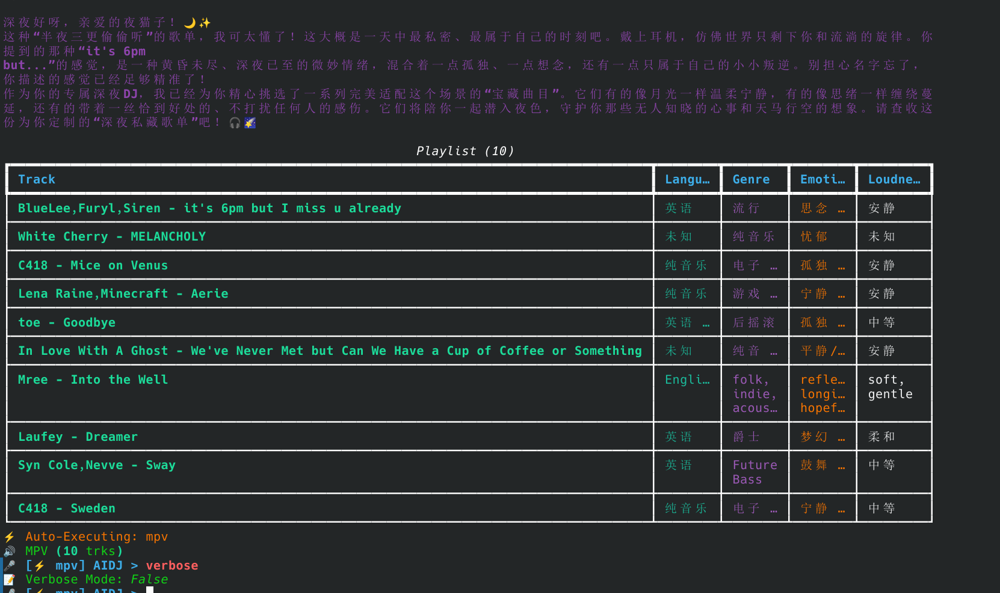
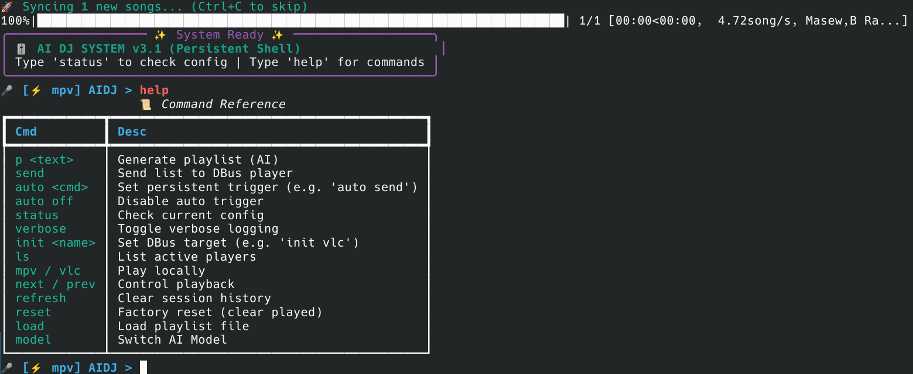
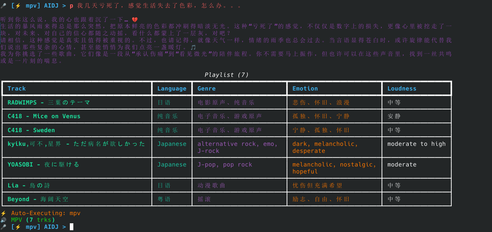
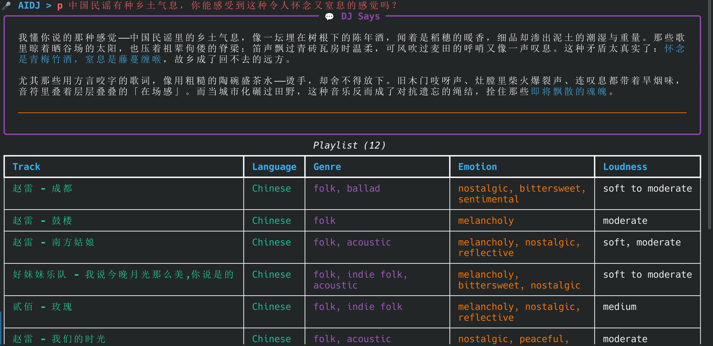

# AIDJ 🎧🙉

你的私人专属DJ，为此时此刻的你提供符合你心意的歌曲。😌🎶
说出你的心情，AI 从你的本地曲库中挑选最合适的曲目，串成一个有故事感的歌单。

只需要准备：
- 支持 OpenAI API 的平台的 BaseURL 和对应的 APIKey
- 一个音乐解析 API，我使用的是本地搭建的，见[这个仓库](https://github.com/Binaryify/NeteaseCloudMusicApi/tree/185031ddcefad34e294df6933418e44cc70ec31f?tab=readme-ov-file) 🔗（PS:下载zip然后偷偷用就行了，不要告诉别人哦🤫🙊）

> **95% 由 AI 编写**，包括架构设计、TUI 界面、命令系统、等待小游戏，全是 vibe 出来的。

# 目录
- [支持的功能](#支持的功能)
- [支持的平台](#支持的平台)
- [运行截图](#运行截图)
- [构建 & 运行](#构建--运行)
- [使用帮助](#使用帮助)
- [没本地曲库咋办](#没本地曲库咋办)

# 支持的功能

| 功能 | 详情 |
| :--: | :--: |
| 自然语言交互 | 说出你想听的歌曲类型、你的心情，甚至是一些意义不明的情绪化句子，AI 便能为你从本地曲库生成一个不错的歌单。歌曲质量你本身已经审核了😱😲😯😮🤯 |
| 随心搭配 AI | 不局限于 DeepSeek，只要支持 OpenAI 的 API 格式，稍加配置你就可以尽情畅聊。支持热切换模型，甚至 metadata 生成和 DJ 对话可以各用各的模型🥰 |
| 私有曲库 | 我不提供歌曲下载方式而是使用你的本地歌曲，这不仅可以帮我避免版权问题也可以让你在你精心下载的音乐中畅游🌊🌊 |
| 歌曲元数据增量生成 | AI 结合音乐解析 API 获取的歌曲信息和热评，自动生成元数据（语言/情绪/流派/响度/评论），曲库增加时自动补充 🤖 |
| Rich TUI | 利用 AI 结合 rich 库 vibe 出了十分美丽的 UI 界面，DJ 输出的 Markdown 渲染、彩色歌单表格、系统状态面板，十分好看😍 |
| 多重播放器支持 | 支持启动 mpv 或者 vlc 来播放生成的歌单。什么？你不使用这两个，你使用 smplayer？😱😱😱😱 我们还支持 D-Bus 控制，因此在 Linux 平台，只要你的软件实现了 D-Bus，就能运行。什么？你是 Windows 并且不使用 vlc 和 mpv？那我没辙了，自己 clone vibe 去吧 |
| 等待的时候还能玩游戏 | AI 推荐耗时可能高达几十秒，这是不可忍受的，因此我 vibe 出来了等待时的小游戏界面 🎲🎮 随机轮播 2048/贪吃蛇/老虎机/pong/恐龙跳跃，按 WASD 可接管操作！ |
| 桌面歌词 | 同步滚动 LRC 歌词，支持沉浸模式——清空屏幕居中大字，氛围感拉满 🔤✨ |
| 动态音量平衡 | ITU-R BS.1770 LUFS 感知响度归一化，歌单内音量自动均衡，再也不用手动调音量了 🔊 |
| 曲库分析 | `/analyse` 命令分析曲库的语言/情绪/流派分布，`/freqtop` 看最常听的歌，`/discover` 帮你发现冷门宝藏 📊 |
| token 透明 | `/token` 命令实时显示当前会话的 token 消耗，prompt 和 completion 分开展示 💰 |

# 支持的平台
- Linux（完整支持）
- MacOS（大概率可用，需安装 mpv/vlc）
- Windows（不直接支持，自己拿 `main.py` 和 `games/` 给 AI vibe 出来吧）

# 运行截图

歌单推荐

启动时截图

和AIDJ对话


等待中

完成


# 构建 & 运行

## 前置要求
你需要有 Python，建议使用 uv 进行局部管理，接着建议拥有 mpv/vlc 中的一个。
在 Arch Linux 中安装步骤如下：
```bash
sudo pacman -S uv mpv vlc mpv-mpris # mpv-mpris是为了让mpv支持dbus控制
```

## 克隆仓库
```bash
git clone https://github.com/aaaa0ggMC/AIDJ.git
cd AIDJ
```

## 创建虚拟环境，安装依赖
```bash
uv venv -p 3.10
uv pip install -r requirements.txt
```

## 创建配置文件
在项目目录下创建 `config.json`，其中 `preferences` 不是必选项目，可以不写，程序会自动生成。其他为必选项目。

```json
{
    "music_folders": [
        "本地音乐库地址"
    ],
    "secrets": {
        "deepseek": "你的API密钥"
    },
    "ai_settings": {
        "base_url": "你选择的endpoint",
        "available_models": [
            "deepseek/deepseek-v3.2",
            "deepseek/deepseek-r1-turbo",
            "moonshotai/kimi-k2-thinking",
            "minimax/minimax-m2",
            "一堆模型，可以通过/model命令切换"
        ],
        "metadata_model": "deepseek/deepseek-v3.2"
    }
}
```

不想手写 JSON？可以用 TUI 配置编辑器：
```bash
uv run cfgedit.py
```

## 运行程序
```bash
uv run main.py
```

# 使用帮助

程序内输入 `help` 或 `?` 就能看到命令目录。超多命令支持，类 bash 的听歌体验 🎹

详细文档在 [`help/`](help/) 目录下：
- [`help/index.md`](help/index.md) — 命令总览
- [`help/system.md`](help/system.md) — 系统设置、配置命令
- [`help/analyse.md`](help/analyse.md) — 曲库分析、频率统计

# 没本地曲库咋办

`tools/download_music` 可通过网易云音乐 API 下载歌曲。详见 [`tools/README.md`](tools/README.md)。

方法总比困难多，因此你能找到方法的！！！🔍

